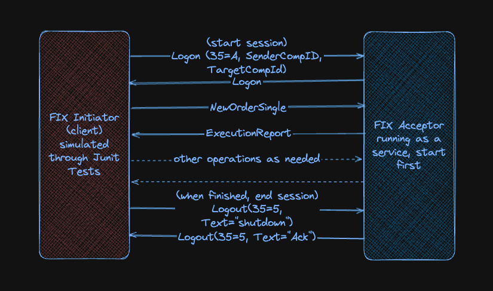

# TODO This is still in progress, do not use
# QuickFIX/J Java Examples: Create, Send, Receive, and Process FIX Messages

This repository demonstrates how to use [QuickFIX/J](https://github.com/quickfix-j/quickfixj) to build Java applications that communicate over the [FIX protocol](https://www.fixtrading.org/).

## 📦 Features

- ✅ Create `NewOrderSingle` (type `D`) and other standard FIX messages
- ✅ Set up **Initiator** (client) and **Acceptor** (server)
- ✅ Send/receive FIX messages over TCP/IP
- ✅ Use standard FIX fields and custom fields
- ✅ Load session settings from `.cfg` files
- ✅ Encode and decode raw SBE binary messages (optional)
- ✅ Full working sample with logs and session management

---

### FIX Architecture
The FIX (Financial Information eXchange) protocol is fundamentally peer-to-peer, not master-slave — but there is an asymmetry in roles:

#### FIX Is Peer-to-Peer (with Roles)
Two parties (e.g., a broker and a client, or an exchange and a trading firm) establish a FIX session over TCP.
Each side can send and receive messages independently during the session.
But there is a defined structure of messages and expectations, and often one side is the Initiator and the other the Acceptor.

#### Initiator vs Acceptor
Initiator: Actively starts the TCP connection and FIX session. Usually the client/trading firm.
Acceptor: Listens for incoming connections. Usually the broker or exchange.
Once connected, both sides can:
Send NewOrderSingle, OrderCancelRequest, etc.
Receive ExecutionReport, Reject, etc.
So message flow is bidirectional, even though connection setup is asymmetric.

#### Is it Like Master-Slave?
No, not in the traditional sense.
There is no strict controller or central authority like in a master-slave system.
Instead, both peers maintain session state, sequence numbers, and can initiate application-level messages.
However, because one side initiates the connection and certain message types are only valid in certain directions (e.g., client sends orders, broker sends fills), it can feel asymmetrical in practice.

#### Example: Buy-Side vs Sell-Side
Buy-Side (Initiator):
Starts connection to broker
Sends NewOrderSingle, OrderCancelRequest
Sell-Side (Acceptor):
Listens for connections
Sends ExecutionReport, OrderCancelReject

#### Session Management
FIX has a session layer:
Logon (MsgType=A)
Logout (MsgType=5)
Sequence reset, heartbeat, test request
Ensures both peers are in sync with sequence numbers and can recover after disconnects.

#### Sample FIX Message
8=FIX.4.4|9=72|35=A|49=CLIENT|56=SERVER|34=1|52=20250101-12:00:00|98=0|108=30|141=Y|10=100|
8: protocol version
9: message size after the pipe (SOH)

✅ Summary
FIX is peer-to-peer in message flow.
But has asymmetric connection roles (Initiator vs Acceptor).
Both sides send and receive messages — not a master-slave architecture.
Acceptor is like an exchange/venue
Initiator is some client who wants to trade
Acceptor runs listening on a port
Initiator opens session with session ID connecting to Acceptor IP + port
After logon, they can start exchanging fix messages
You can see FIX Logon (35=A) and Logout (35=5) Messages being exchanged

It’s more like a stateful, ordered messaging protocol over TCP, with predefined roles.
---

## 📁 Project Structure

```text
learn_fix_with_quickfix
├── broker
    ├── src/
    │   ├── main/
    │   │   └── java/
    │   │       ├── com.codingmonster.broker.AcceptorApplication       # Acceptor logic
    │   │       ├── com.codingmonster.broker.AcceptorRunner            # starter with main
    │   └── resources/
    │       └── acceptor.cfg         # Server-side FIX config
        │   └── FIX44.xml   
    │       └── logback.xml    
    │   ├── test/
    │   │   └── java/
    │   │       ├── com.codingmonster.client.InitiatorApplication       # Initiator logic
    │   │       ├── com.codingmonster.client.InitiatorRunner            # starter with main
    │   └── resources/
    │       └── initiator.cfg         # client-side FIX config    
    │       └── FIX44.xml   
    │       └── logback-test.xml    
    ├── build.gradle
├── settings.gradle
├── gradle.properties
├── README.md
```

## How it is organized

Single module called broker, to keep things simple
src/main/java has the server side called acceptor in fix parlance
src/test/java has the client being simulated using JUnit
FIX44.xml is already part of quick-all lib, but I have added and set in cfg files so you can experiment with it
So you have to start server, and then run tests as explained below
Watch the two consoles, client side (tests) and server (acceptor) for log messages
I have added lots of messages and thread.sleep to give a good understanding of interaction



## How to Run

https://github.com/apusingh1967/learn_fix_with_quickfixj.git

cd learn_fix_with_quickfixj

#### Run Acceptor - receiving fix messages, processing and sending execution report back
gradle :broker:run

#### Run Initiator - sending fix messages
gradle :broker:test

Issues
may need to `unset GRADLE_OPTS` in case cant see logs on console
*Important*: 
Acceptor maintains message sequence number, and always accepts messages in strict sequence per client
So after each client (junit) run, better to restart acceptor

## Learning Resources
https://www.youtube.com/watch?v=l1X7pD9nU8A
https://javarevisited.blogspot.com/2011/04/fix-protocol-tutorial-for-beginners.html
